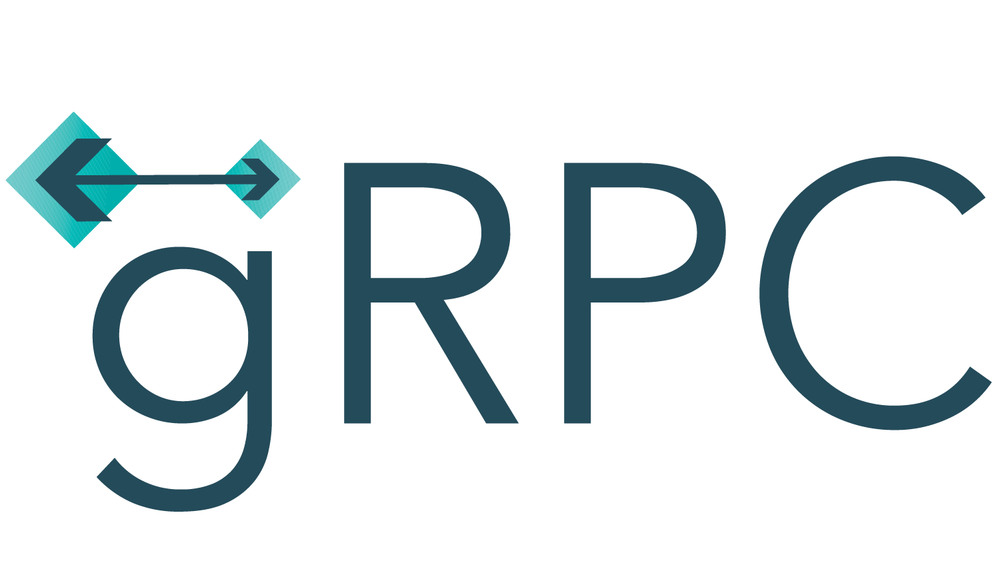

<h1 align="center">
  </img>
  <br>
  <b>Chat gRPC</b>
</h1>

<p align="center">A chat application using gRPC to communicate between processes.</p>

<!-- Badges -->
<p align="center">
  <a href="https://github.com/QuanBlue/chat-grpc/graphs/contributors">
    
  </a>
  <a href="">
    
  </a>
  <a href="https://github.com/QuanBlue/chat-grpc/network/members">
    
  </a>
  <a href="https://github.com/QuanBlue/chat-grpc/stargazers">
    
  </a>
  <a href="https://github.com/QuanBlue/chat-grpc/issues/">
    
  </a>
  <a href="https://github.com/QuanBlue/chat-grpc/blob/main/LICENSE">
    
  </a>
</p>

<p align="center">
  <b>
      <a href="#demo">Demo</a> •
      <a href="https://github.com/QuanBlue/chat-grpc">Documentation</a> •
      <a href="https://github.com/QuanBlue/chat-grpc/issues/">Report Bug</a> •
      <a href="https://github.com/QuanBlue/chat-grpc/issues/">Request Feature</a>
  </b>
</p>

<br/>

<details open>
<summary><b>📖 Table of Contents</b></summary>

-  [:dizzy: Introduction](#dizzy-introduction)
   -  [What is gRPC?](#what-is-grpc)
   -  [Why gRPC?](#why-grpc)
-  [:film_projector: Demo](#film_projector-demo)
-  [:newspaper: Report](#newspaper-report)
-  [:star: Key Features](#star-key-features)
-  [:toolbox: Getting Started](#toolbox-getting-started)
   -  [:pushpin: Prerequisites](#pushpin-prerequisites)
   -  [:mechanical_arm: How to use gRPC](#mechanical_arm-how-to-use-grpc)
   -  [:hammer_and_wrench: Run Locally](#hammer_and_wrench-run-locally)
-  [:speech_balloon: Chat Convention](#speech_balloon-chat-convention)
   -  [LIKE reply](#like-reply)
   -  [Exception](#exception)
-  [:page_facing_up: Log](#page_facing_up-log)
   -  [Log file](#log-file)
   -  [Content](#content)
-  [:busts_in_silhouette: Contributors](#busts_in_silhouette-contributors)
-  [:sparkles: Credits](#sparkles-credits)
-  [:scroll: License](#scroll-license)
</details>

# :dizzy: Introduction

An application use gRPC to communicate between processes and allow users chat with each other.

## What is gRPC?

gRPC (Google Remote Procedure Call) is an open-source, high-performance remote procedure call (RPC) framework developed by Google. It allows communication between client and server applications in a distributed system, enabling them to call methods or functions on remote systems as if they were local.

**Key features of gRPC include:** `Language-agnostic`, `Protocol Buffers`, `Bi-directional Streaming`, `Strong Typing and Code Generation`, `Interoperability`, `Performance`.

gRPC is widely used in various domains, including microservices architectures, cloud-native applications, and distributed systems. It simplifies the development of client-server communication, promotes code reusability, and enables the building of scalable and performant applications.

## Why gRPC?

-  Efficient Communication
-  Language Agnostic
-  Strong Typing and Code Generation
-  Streaming and Real-Time Capabilities
-  Performance and Scalability
-  Extensibility and Interoperability

# :film_projector: Demo

Check out the [**demo video**](https://www.youtube.com/watch?v=j3ZhaS5n7hU&ab_channel=ThanhQu%C3%A2nCoder) to see the app in action.

# :newspaper: Report

Check out the [**report**](https://docs.google.com/document/d/1XG1qBbMOVZpRwFrU5hV9Z66X6tNGrkkXGsKeIZU_Ns8/edit) to see full report document.

# :star: Key Features

-  CLI interface
-  Server - Client
-  Communication between processes - gRPC
-  Voting - At least 2 other users LIKE the before msg to send new msg
-  Log file

# :toolbox: Getting Started

## :pushpin: Prerequisites

-  **Python:** >= 3.10.7
-  **gRPC tools:** gRPC compiler, Install [here](https://grpc.io/docs/languages/python/quickstart/).

## :mechanical_arm: How to use gRPC

**1**. **Define your gRPC service** using protocol buffers. This will define the messages and methods used for communication.

1. Define your service in a .proto file using protocol buffer syntax. (`chat.proto` in `/service`)

   ```go
   syntax = "proto3";

   service ChatService {
     rpc SendMessage(Message) returns (Message) {}
     rpc ReceiveMessage(Empty) returns (stream Message) {}
   }

   message Message {
     string user_name = 1;
     string text = 2;
   }

   message Empty {}
   ```

   <details>
     <summary>Explain variable</summary>

   This defines a:

   -  **Message** type with `text` and `sender` fields
   -  **ChatService** with two methods:
      -  `SendMessage` takes a `Message` object as input and returns a `Message` object
      -  `ReceiveMessage` takes an empty `Empty` object as input and returns a stream of `Message` objects.

   </details>

2. Use the generated code to implement your gRPC service.

   ```shell
   python -m grpc_tools.protoc -I [path/to/protos/dir] --python_out=[path/to/output/python] --grpc_python_out=[path/to/output/grpc/python] [/path/to/protos/file.proto]
   ```

   Example:

   ```shell
    python3 -m grpc_tools.protoc -I service --python_out=./service --grpc_python_out=./service ./service/user.proto

   python3 -m grpc_tools.protoc -I service/proto --python_out=./service --grpc_python_out=./service ./service/proto/chat.proto
   ```

3. **Implement the server-side code** for your gRPC service. This will handle incoming requests and provide responses. You can create a new process for each instance of your gRPC server.
     <details>
       <summary>Explain server</summary>

   -  This defines a `ChatServiceServicer` class that implements the `ChatService` defined in `chat.proto`. The `SendMessage` function appends the received message to a list of messages and returns the same message. The `ReceiveMessage` function yields all the messages in the list.
   -  The `serve` function creates a gRPC server and adds the `ChatServiceServicer` to it. It starts the server on port `50051`.

      </details>

4. **Implement the client-side code** for your gRPC service. This will send requests to the server and receive responses. You can create one or more client processes as needed.

5. **Start** the `server process` and `client process(es)`.

6. Use gRPC's built-in functionality to handle the communication between the server and client processes.

## :hammer_and_wrench: Run Locally

Install application

```bash
# Clone this repository
git clone https://github.com/QuanBlue/chat-grpc.git

# Go into the repository
cd chat-grpc
```

Run server

```bash
python server.py
```

Run client (open new terminal)

```bash
python client.py
```

> **Note:** Run multiple client by using multiple terminal

# :speech_balloon: Chat Convention

## LIKE reply

> **LIKE reply:** for allow user XX to continue chat (at least 2 LIKE)

**Syntax:** `LIKE_<user_id>`

**Rule:**

-  Only LIKE once per user
-  Can not LIKE your self

<u>Example:</u> LIKE_01

## Exception

**Syntax:** `[<type>] <content>_<user_id>`

**Program exception:**

```log
[WARNING] You can not LIKE yourself_<from_user>!
[WARNING] You only LIKED: [<user_id>]'s message ONCE!_<from_user>
[WARNING] You are NOT allowed to send message_<from_user>
[INFO] You LIKED: [<user_id>]'s message_<from_user>
```

# :page_facing_up: Log

## Log file

**Syntax:** `[<time>] <content>`

```log
<!-- logfile.log exapmle  -->
[15:47:47] Quan join group chat - ID(01)
[15:47:54] User[01] send message 'hello'
[15:47:54] User[01] is BLOCKED to send message
[15:48:08] User[01] is not allow to send message
[15:48:15] Van join group chat - ID(02)
[15:48:20] Lien join group chat - ID(03)
[15:48:23] Hao join group chat - ID(04)
[15:48:29] Dat join group chat - ID(05)
[15:48:35] User[05] send message 'hello'
[15:48:35] User[05] is BLOCKED to send message
[15:48:42] User[04] send message 'chao moi nguoi'
[15:48:42] User[04] is BLOCKED to send message
[15:48:51] User[03] send message 'alo alo'
[15:48:51] User[03] is BLOCKED to send message
[15:49:03] User[03] like for User[01]
[15:49:15] User[03] like for User[01]
[15:49:28] User[03] like for User[03]
[15:49:36] User[04] like for User[01]
[15:49:36] User[01] is ALLOWED to send message
[15:49:56] User[01] send message 'hi , i am free'
[15:49:56] User[01] is BLOCKED to send message
[15:50:00] User[01] is not allow to send message
```

## Content

Client connect and enter username:

```
<username> join group chat - ID(<user_id>)
```

Client send msg success:

```
User[<user_id>] send message ‘<message>
```

Client A like client B's msg:

```
User[<userA_id>] like for User[<userB_id>]
```

Client being block send msg but still try sending msg:

```
User[<user_id>] is not allow to send message
```

Client has been blocked from sending messages:

```
User[<user_id>] is BLOCKED to send message
```

The client is allowed to send messages:

```
User[<user_id>] is ALLOWED to send message
```

# :busts_in_silhouette: Contributors

<a href="https://github.com/QuanBlue/chat-grpc/graphs/contributors">
  
</a>

Contributions are always welcome!

# :sparkles: Credits

This software uses the following open source packages:

-  [gRPC](https://grpc.io/)
-  Emojis are taken from [here](https://github.com/arvida/emoji-cheat-sheet.com)

# :scroll: License

Distributed under the MIT License. See <a href="./LICENSE">`LICENSE`</a> for more information.

---

> Bento [@quanblue](https://bento.me/quanblue) &nbsp;&middot;&nbsp;
> GitHub [@QuanBlue](https://github.com/QuanBlue) &nbsp;&middot;&nbsp; Gmail quannguyenthanh558@gmail.com
