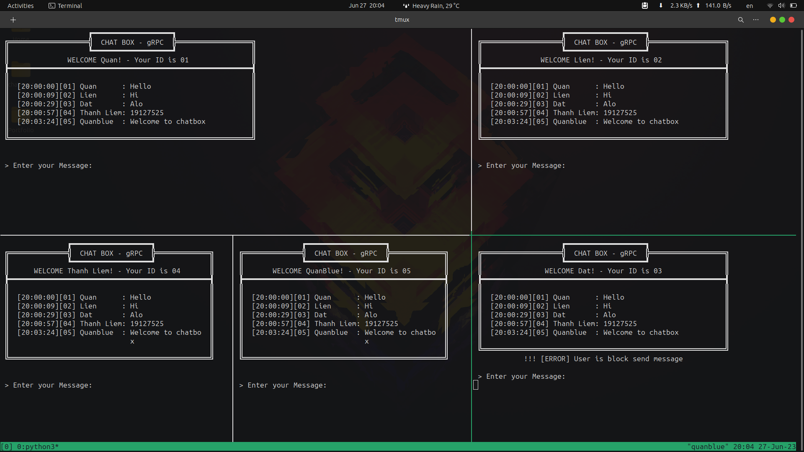
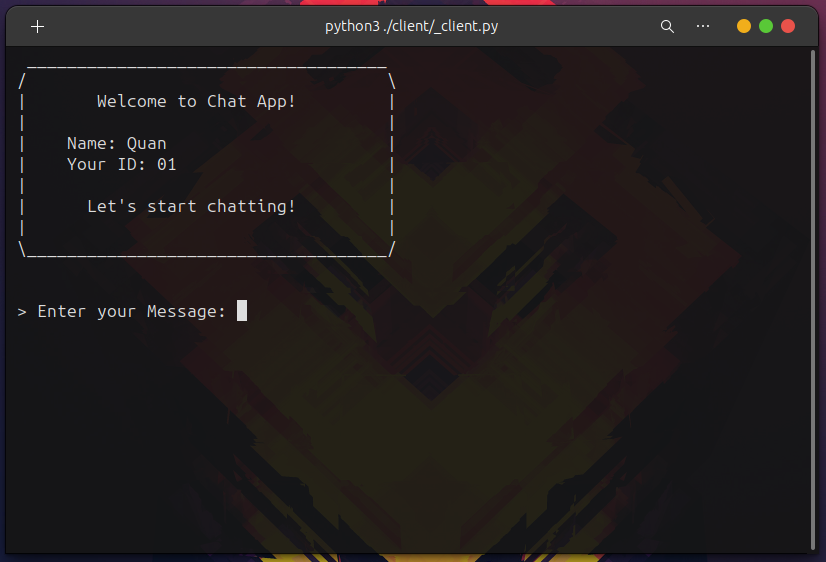
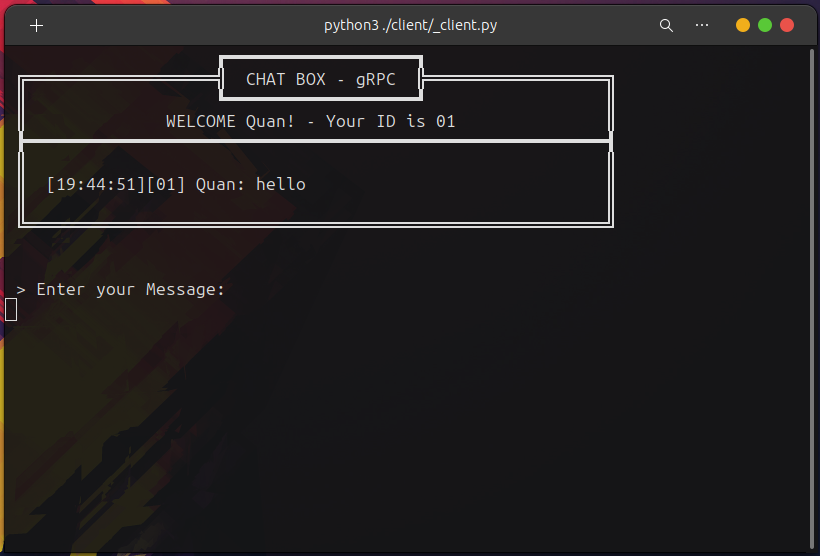
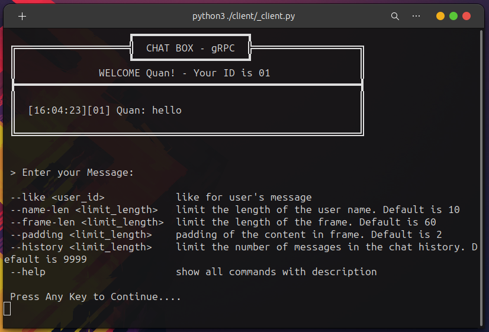
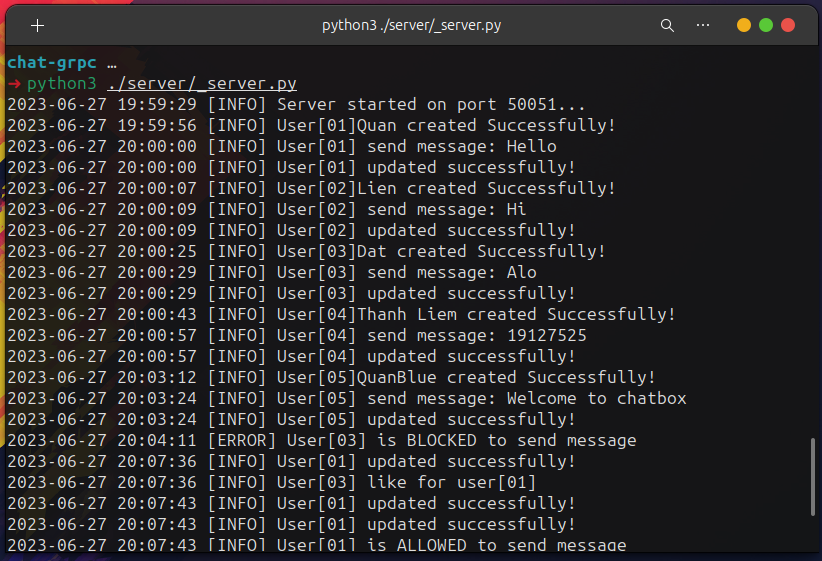

<h1 align="center">
  </img>
  <br>
  <b>Chat gRPC</b>
</h1>

<p align="center">A chat application using gRPC to communicate between processes.</p>

<!-- Badges -->
<p align="center">
  <a href="https://github.com/QuanBlue/chat-grpc/graphs/contributors">
    
  </a>
  <a href="">
    
  </a>
  <a href="https://github.com/QuanBlue/chat-grpc/network/members">
    
  </a>
  <a href="https://github.com/QuanBlue/chat-grpc/stargazers">
    
  </a>
  <a href="https://github.com/QuanBlue/chat-grpc/issues/">
    
  </a>
  <a href="https://github.com/QuanBlue/chat-grpc/blob/main/LICENSE">
    
  </a>
</p>

<p align="center">
  <b>
      <a href="https://youtu.be/DdqMn6Drp0g">Demo</a> •
      <a href="https://github.com/QuanBlue/chat-grpc">Documentation</a> •
      <a href="https://github.com/QuanBlue/chat-grpc/issues/">Report Bug</a> •
      <a href="https://github.com/QuanBlue/chat-grpc/issues/">Request Feature</a>
  </b>
</p>

<br/>



<details open>
<summary><b>📖 Table of Contents</b></summary>

-  [Introduction](#dizzy-introduction)
   -  [What is gRPC?](#what-is-grpc)
   -  [Why gRPC?](#why-grpc)
-  [About the Project](#star2-about-the-project)
   -  [Screenshots](#camera-screenshots)
   -  [Demo](#film_projector-demo)
   -  [Documentation](#newspaper-documentation)
   -  [Features](#star-features)
-  [Getting Started](#toolbox-getting-started)
   -  [Prerequisites](#pushpin-prerequisites)
   -  [How to use gRPC](#mechanical_arm-how-to-use-grpc)
   -  [Folder structure](#file_folder-folder-structure)
   -  [Run Locally](#hammer_and_wrench-run-locally)
-  [Command](#speech_balloon-command)
-  [Like message rule](#robot-like-message-rule)
-  [Log](#page_facing_up-log)
   -  [Log file](#log-file)
   -  [Content](#content)
-  [Roadmap](#world_map-roadmap)
-  [Contributors](#busts_in_silhouette-contributors)
-  [Credits](#sparkles-credits)
-  [License](#scroll-license)
</details>

# :dizzy: Introduction

An application use gRPC to communicate between processes and allow users chat with each other.

## What is gRPC?

gRPC (Google Remote Procedure Call) is an open-source, high-performance remote procedure call (RPC) framework developed by Google. It allows communication between client and server applications in a distributed system, enabling them to call methods or functions on remote systems as if they were local.

**Key features of gRPC include:** `Language-agnostic`, `Protocol Buffers`, `Bi-directional Streaming`, `Strong Typing and Code Generation`, `Interoperability`, `Performance`.

gRPC is widely used in various domains, including microservices architectures, cloud-native applications, and distributed systems. It simplifies the development of client-server communication, promotes code reusability, and enables the building of scalable and performant applications.

## Why gRPC?

-  Efficient Communication
-  Language Agnostic
-  Strong Typing and Code Generation
-  Streaming and Real-Time Capabilities
-  Performance and Scalability
-  Extensibility and Interoperability

# :star2: About the Project

## :camera: Screenshots

<div align="center">
  <div>
    
      <i>Figure 1: Welcome UI</i>
    </img>
  </div>
  <br>
  <div>
    
      <i>Figure 2: Chatbox UI</i>
    </img>
  </div>
  <br>
  <div>
    
      <i>Figure 3: App command</i>
    </img>
  </div>
  <br>
  <div>
    
      <i>Figure 4: Server log</i>
    </img>
  </div>
</div>

## :film_projector: Demo

Check out the [**Demo video**](https://youtu.be/DdqMn6Drp0g) to see the app in action.

## :newspaper: Documentation

Check out the [**Documentation**](https://docs.google.com/document/d/1ehqlwr8YSOfgmqYLNv7WkniywJDngN6vRjhilsBCNRY/edit?usp=sharing) to see full report document.

Detail Documentation:

-  [Client documentation](https://github.com/QuanBlue/chat-grpc/tree/main/client).
-  [Server documentation](https://github.com/QuanBlue/chat-grpc/tree/main/server).
-  [Service documentation](https://github.com/QuanBlue/chat-grpc/tree/main/services).

## :star: Features

-  CLI interface
-  Interact, customize command
-  Server - Client
-  Communication between processes - gRPC
-  Voting - At least 2 other users LIKE the before msg to send new msg
-  Log file

# :toolbox: Getting Started

## :pushpin: Prerequisites

-  **Python:** >= 3.10.7
-  **gRPC tools:** gRPC compiler, Install [here](https://grpc.io/docs/languages/python/quickstart/).

## :mechanical_arm: How to use gRPC

<u>**Step 1:**</u> **Define your gRPC service** using protocol buffers.

> Refer to [Service documentation](https://github.com/QuanBlue/chat-grpc/tree/main/service) for more information.

<u>**Step 2:**</u> **Implement the server-side code** for your gRPC service. This will handle incoming requests and provide responses. You can create a new process for each instance of your gRPC server.

> Refer to [Server documentation](https://github.com/QuanBlue/chat-grpc/tree/main/server) for more information.

<u>**Step 3:**</u> **Implement the client-side code** for your gRPC service. This will send requests to the server and receive responses. You can create one or more client processes as needed.

> Refer to [Client documentation](https://github.com/QuanBlue/chat-grpc/tree/main/client) for more information.

<u>**Step 4:**</u> Start the `server process` and `client process(es)`.

## :file_folder: Folder structure

This project has the following file structure:

```bash
chat-grpc/                      # Root directory of the project
├── README.md                   # Markdown file with project information
├── LICENSE                     # File specifying the project's license
├── .gitignore                  # File specifying Git ignore patterns
├── assets/                     # Directory for project assets
│   ├── image1.png
│   ├── image2.png
│   └── image...
├── logs/                       # Directory for log files
│   └── logfile.log
├── utils/                      # Directory for utility files
│   ├── helper.png
│   └── logger.py
├── services/                   # Directory for service-related files
│   ├── proto/                  # Directory for protocol buffer definition files
│   │   ├── chat.proto
│   │   ├── share_type.proto
│   │   └── user.proto
│   ├── grpc_generated/         # Directory for generated gRPC files
│   │   ├── chat_pb2.py
│   │   ├── chat_pb2_grpc.py
│   │   ├── share_type_pb2.py
│   │   ├── share_type_pb2_grpc.py
│   │   ├── user_pb2.py
│   │   └── user_pb2_grpc.py
│   └── README.md
├── client/                     # Directory for client-related files
│   ├── _client.py
│   └── README.md
└── server/                     # Directory for server-related files
    ├── _server.py
    ├── services_class/         # Directory for service-specific classes
    │   ├── user_service.py
    │   └── chat_service.py
    └── README.md
```

## :hammer_and_wrench: Run Locally

Install application

```bash
# Clone this repository
git clone https://github.com/QuanBlue/chat-grpc.git

# Go into the repository
cd chat-grpc
```

Run server

```bash
python3 ./server/_server.py
```

Run client (open new terminal)

```bash
python3 ./client/_client.py
```

> **Note:** Run multiple client by using multiple terminal

# :speech_balloon: Command

We provide a CLI interface for the client. The CLI interface allows users to interact with the chat application with simple commands:

```
--like [user id]             like for user's message,
--name-len [limit length]    limit the length of the user name. Default is 10,
--frame-width [limit length]   limit the length of the frame. Default is 60,
--padding [limit length]     padding of the content in frame. Default is 2,
--history [limit length]     limit the number of messages in the chat history. Default is 9999,
--help                       show all commands with description,
```

# :robot: Like message rule

> **LIKE reply:** for allow user XX to continue chat (at least 2 LIKE)

**Command:** `--like [user id]`

**Rule:**

-  Only LIKE once per user
-  Can not LIKE your self

<u>Example:</u> `--like 01`

# :page_facing_up: Log

## Log file

**Syntax:** `<yyyy-mm-ddd hh-mm-ss> [TYPE] <content>`

```log
<!-- logs/logfile.log exapmle  -->

2023-06-27 09:32:31 [INFO] Server started on port 50051...
2023-06-27 09:32:35 [INFO] User[01]Quan created Successfully!
2023-06-27 09:32:38 [INFO] User[01] send message: hello
2023-06-27 09:32:38 [INFO] User[01] updated successfully!
2023-06-27 09:32:46 [ERROR] User[01] can not LIKE yourself!
2023-06-27 09:37:01 [ERROR] Getting user! User[adaw] not found!
2023-06-27 09:49:42 [ERROR] User[01] is BLOCKED to send message
2023-06-27 09:49:48 [INFO] User[02]Lien created Successfully!
2023-06-27 09:49:50 [INFO] User[01] updated successfully!
2023-06-27 09:49:50 [INFO] User[02] like for user[01]
2023-06-27 09:49:55 [ERROR] User[01] only LIKED: [01]'s message ONCE!
2023-06-27 09:50:42 [ERROR] User[01] can not LIKE yourself!
2023-06-27 09:51:05 [INFO] User[03]Dat created Successfully!
2023-06-27 09:49:50 [INFO] User[03] like for user[01]
2023-06-27 09:51:07 [INFO] User[01] updated successfully!
2023-06-27 09:51:07 [INFO] User[01] is ALLOWED to send message
...
```

## Content

Server start success:

```log
[INFO] Server started on port 50051...
```

Client connect and enter username:

```log
[INFO] User[<user_id>]<username> created Successfully!
[ERROR] User[<user_id>]<username> created Fail!
```

Client send msg success:

```log
[INFO] User[<user_id] send message: <message>
```

Update Client stat (like, block, allow):

```log
[INFO] User[<user_id>] updated successfully!
[ERROR] Getting user! User[<user_id>] not found!
```

Client A like client B's msg:

```log
[INFO] User[<userA_id>] like for User[<userB_id>]
[ERROR] User[<userA_id>] only LIKED: [<userB_id>]'s message ONCE!
[ERROR] User[<userA_id>] can not LIKE yourself!

```

The client is allowed/blocked to send messages:

```log
[INFO] User[<user_id>] is ALLOWED to send message
[ERROR] User[<user_id>] is BLOCKED to send message
```

# :world_map: Roadmap

-  [x] UI
-  [x] Command line - customize UI (padding, table width,...)
-  [x] Communication
-  [x] Logs
-  [x] Multi-threading (client)
-  [x] Chatting rule - At least 2 LIKE (from 2 others) to continue chat
-  [x] Demo
-  [x] Documentation

# :busts_in_silhouette: Contributors

<a href="https://github.com/QuanBlue/chat-grpc/graphs/contributors">
  
</a>

Contributions are always welcome!

# :sparkles: Credits

This software uses the following open source packages:

-  [gRPC](https://grpc.io/)
-  Emojis are taken from [here](https://github.com/arvida/emoji-cheat-sheet.com)

# :scroll: License

Distributed under the MIT License. See <a href="./LICENSE">`LICENSE`</a> for more information.

---

> Bento [@quanblue](https://bento.me/quanblue) &nbsp;&middot;&nbsp;
> GitHub [@QuanBlue](https://github.com/QuanBlue) &nbsp;&middot;&nbsp; Gmail quannguyenthanh558@gmail.com
