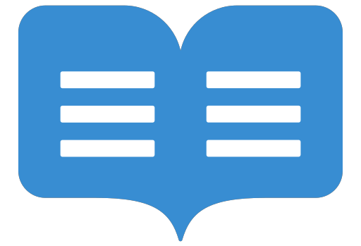

<h1 align="center">
  </img>
  <br>
  <b>README template</b>
</h1>

<p align="center">Structured guide to create informative project documentation, providing a standard format for conveying project details and instructions.</p>

<!-- Badges -->
<p align="center">
  <a href="https://github.com/QuanBlue/Readme-template/graphs/contributors">
    
  </a>
  <a href="">
    
  </a>
  <a href="https://github.com/QuanBlue/Readme-template/network/members">
    
  </a>
  <a href="https://github.com/QuanBlue/Readme-template/stargazers">
    
  </a>
  <a href="https://github.com/QuanBlue/Readme-template/issues/">
    
  </a>
  <a href="https://github.com/QuanBlue/Readme-template/blob/main/LICENSE">
    
  </a>
</p>

<p align="center">
  <b>
      <a href="#demo">Demo</a> •
      <a href="https://github.com/QuanBlue/Readme-template">Documentation</a> •
      <a href="https://github.com/QuanBlue/Readme-template/issues/">Report Bug</a> •
      <a href="https://github.com/QuanBlue/Readme-template/issues/">Request Feature</a>
  </b>
</p>

<br/>


<details open>
<summary><b>📖 Table of Contents</b></summary>

-  [Demo](#film_projector-demo)
-  [Key Features](#star-key-features)
-  [Getting Started](#toolbox-getting-started)
   -  [Prerequisites](#pushpin-prerequisites)
   -  [Environment Variables](#key-environment-variables)
   -  [Installation](#hammer_and_wrench-installation)
-  [Roadmap](#world_map-roadmap)
-  [Contributors](#busts_in_silhouette-contributors)
-  [Credits](#sparkles-credits)
-  [License](#scroll-license)
-  [Related Projects](#link-related-projects)
</details>

# :film_projector: Demo

Check out the [**demo video**](https://www.youtube.com/channel/UCALhAytLBhmG2un43YxU4mw) to see the app in action.  
Here is deployed website: [**https://quanblue.netlify.app/**](https://quanblue.netlify.app/)

# :star: Key Features

-  Template - professional README, [Release](./Release.md) templates
-  Theme - nice theme for README

# :toolbox: Getting Started

## :pushpin: Prerequisites

-  **Python:** `>= 3.10.7`
-  **Docker Engine:** Docker provides a consistent and portable environment for running applications in containers. Install [here](https://www.docker.com/get-started/).

## :key: Environment Variables

To run this project, you need to add the following environment variables to your `.env` file in `/`:

-  **App configs:** Create `.env` file in `./`

   -  `SECRET_KEY`: a key used by Flask to encrypt and sign session data.
   -  `PORT`: specify which port the Flask application should listen on.

   Example:

   ```sh
   # .env
   SECRET_KEY="Readme-template"
   PORT=3000
   ```

You can also check out the file `.env.example` to see all required environment variables.

> **Note**: If you want to use this example environment, you need to rename it to `.env`.

## :hammer_and_wrench: Installation

To clone and run this application, you'll need [Git](https://git-scm.com) and [Python](https://www.python.org/downloads/) installed on your computer. From your command line:

```bash
# Clone this repository
git clone https://github.com/QuanBlue/Readme-template

# Go into the repository
cd Readme-template

# Install dependencies
npm install

# Run the app
npm start
```

> **Note**
> If you're using Linux Bash for Windows, [see this guide](https://www.howtogeek.com/261575/how-to-run-graphical-linux-desktop-applications-from-windows-10s-bash-shell/) or use `node` from the command prompt.

# :world_map: Roadmap

-  [x] Update theme
-  [x] Emoji
-  [ ] Add more features

# :busts_in_silhouette: Contributors

<a href="https://github.com/QuanBlue/Readme-template/graphs/contributors">
  
</a>

Contributions are always welcome!

# :sparkles: Credits

This software uses the following open source packages:

-  [Node.js](https://nodejs.org/)
-  [Marked - a markdown parser](https://github.com/chjj/marked)
-  Emojis are taken from [here](https://github.com/arvida/emoji-cheat-sheet.com)

# :scroll: License

Distributed under the MIT License. See <a href="./LICENSE">`LICENSE`</a> for more information.

# :link: Related Projects

-  <u>[**QuanBlue**](https://github.com/QuanBlue/QuanBlue)</u>: My bio
-  <u>[**Portfolio**](https://github.com/QuanBlue/Portfolio)</u>: My first portfolio website, using MERN stack. [Visit here](https://quanblue.netlify.app/)
-  <u>[**Readme-template**](https://github.com/QuanBlue/Readme-template)</u>: A template for creating README.md

---

> Bento [@quanblue](https://bento.me/quanblue) &nbsp;&middot;&nbsp;
> GitHub [@QuanBlue](https://github.com/QuanBlue) &nbsp;&middot;&nbsp; Gmail quannguyenthanh558@gmail.com
